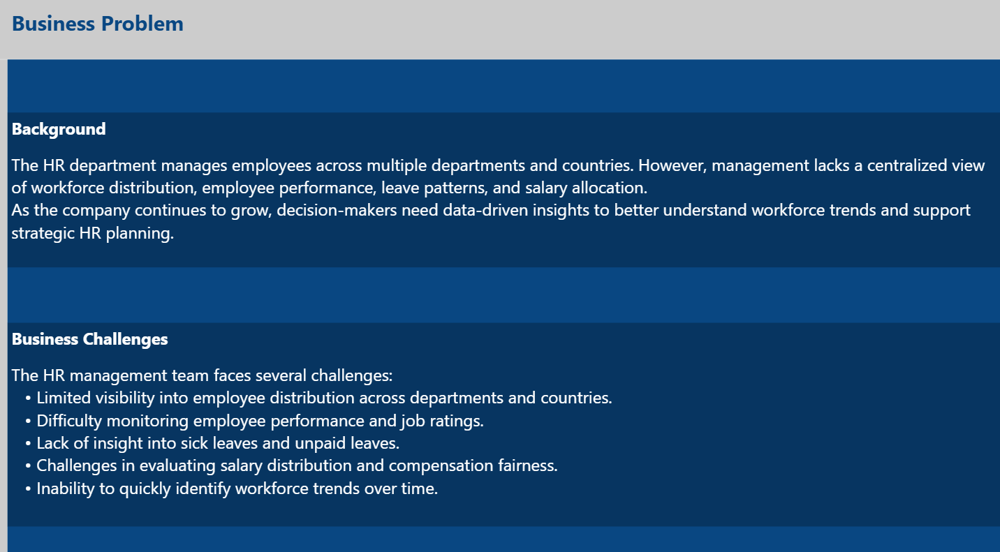
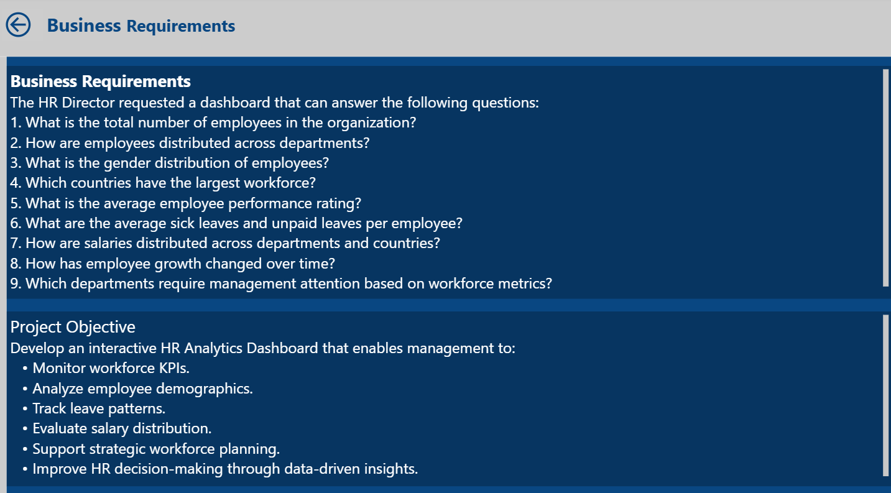
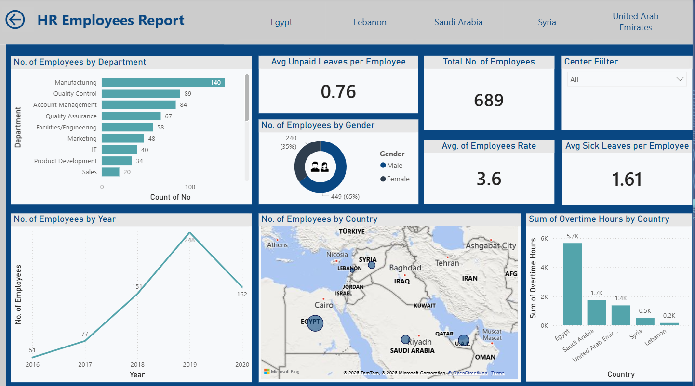
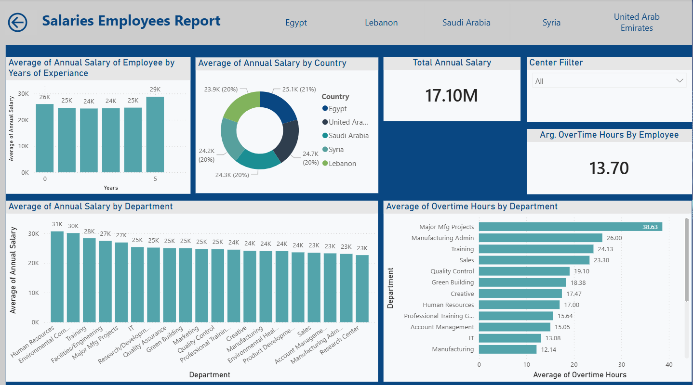
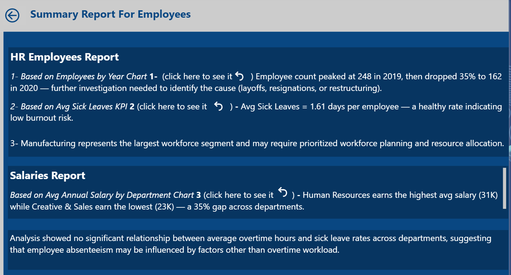

# HR Analytics Dashboard

An end-to-end HR analytics project built in Power BI to help management understand workforce distribution, salary patterns, leave behavior, overtime load, and employee growth across countries and departments.

## Executive Summary

This project turns a flat employee dataset into an executive dashboard with clear HR KPIs and decision-ready insights.

The analysis shows:
- A workforce of **689 employees** across **20 departments** and **5 countries**.
- **Manufacturing** is the largest department, while **Egypt** has the largest employee base.
- Employee growth peaked in **2019**, with the largest year-over-year workforce increase.
- Average salary is **24.8K** annually, with visible variation across departments and countries.
- Average sick leave is **1.61 days** per employee, and the relationship between overtime and sick leave is essentially negligible in this dataset.

## Business Problem

The HR team lacked a centralized view of workforce metrics, which made it difficult to monitor employee trends, compare departments, and support strategic decisions around staffing, compensation, and workload planning.

## Project Objectives

- Monitor workforce KPIs in one place.
- Analyze employee distribution by department, country, and gender.
- Track salary and leave patterns.
- Identify workforce trends over time.
- Highlight areas that require management attention.

## Dataset Snapshot

- Rows: **689 employees**
- Columns: **15**
- Missing values: **0**
- Duplicate rows: **0**
- Time span: **2016 to 2020**
- Countries: **Egypt, United Arab Emirates, Saudi Arabia, Syria, Lebanon**
- Departments: **20**

## KPI Summary

- Total employees: **689**
- Average performance rating: **3.6**
- Average sick leaves per employee: **1.61**
- Average unpaid leaves per employee: **0.76**
- Average overtime hours per employee: **13.70**
- Total annual salary: **17.10M**
- Average annual salary: **24.8K**

## Key Insights

1. **Manufacturing leads headcount**
   - Manufacturing has the largest workforce with **140 employees**.
   - This makes it the most important area for staffing, scheduling, and operational planning.

2. **Egypt dominates workforce concentration**
   - Egypt has **379 employees**, the highest count among all countries.
   - That concentration should be considered when interpreting country-level salary and overtime patterns.

3. **Workforce growth peaked in 2019**
   - Headcount rose from **51 in 2016** to **248 in 2019**, then declined to **162 in 2020**.
   - This pattern suggests either a hiring slowdown, restructuring, or a change in staffing strategy after the 2019 peak.

4. **Compensation varies materially by department**
   - Highest average annual salary: **Human Resources** at about **30.7K**
   - Lowest average annual salary: **Research Center** at about **22.6K**
   - This gap is meaningful and worth reviewing for internal equity and role alignment.

5. **Overtime and sick leave are not meaningfully linked here**
   - The correlation between overtime hours and sick leaves is approximately **-0.03**.
   - In this dataset, overtime does not appear to explain sick leave behavior.

6. **2020 employees show the highest average salary**
   - Employees who started in **2020** have the highest average annual salary in the dataset.
   - That may indicate a changed hiring mix, revised pay structure, or both.

## Recommended Actions

- Review salary bands by department to check for consistency and internal equity.
- Investigate the 2019 to 2020 workforce drop to understand whether it was driven by attrition, restructuring, or hiring policy changes.
- Segment leave analysis by department and country to identify localized absenteeism patterns.
- Add turnover, tenure, and promotion data in a future version to make the dashboard more strategic.
- Convert the current descriptive dashboard into a more diagnostic HR performance model with drill-through pages and trend comparisons.

## Dashboard Pages

- **Business Problem** - explains the context and challenges.
- **Business Requirements** - documents the questions the dashboard is designed to answer.
- **HR Employees Report** - headcount, gender, country, leave, overtime, and growth analysis.
- **Salaries Employees Report** - salary distribution by year of experience, country, department, and overtime.
- **Diagnostic Details** - highlights workload pressure, leave patterns, performance alignment, and payroll concentration by department.
- **Summary Report** - executive-level narrative summary of the main findings.

## Tools Used

- Power BI
- Power Query
- DAX

## Project Structure

```text
HR-Analytics-Dashboard/
├── Data/
│   └── Employees.xlsx
├── Images/
│   ├── Business_Problem.png
│   ├── Business_Requirements.png
│   ├── HR_Employees_Report.png
│   ├── Salaries_Employees_Report.png
│   └── Summary_Report.png
├── Employee-Analysis.pbix
└── README.md
```

## Limitations

- The dataset is a snapshot, so it does not include turnover, exit reasons, or promotion history.
- Correlations shown in the dashboard should not be treated as causal relationships.
- Country comparisons should be interpreted carefully because the sample is uneven across locations.

## Dashboard Preview

### Business Problem
The business challenge and the reason for building the dashboard.


### Business Requirements
The key questions the dashboard is designed to answer.


### HR Employees Report
Headcount, country, gender, leave, overtime, and workforce growth analysis.


### Salaries Employees Report
Salary distribution across departments, countries, and years of experience.


### Diagnostic Details
Department-level workload, leave, performance, and payroll comparison.

### Summary Report
Executive-level narrative of the main findings.

